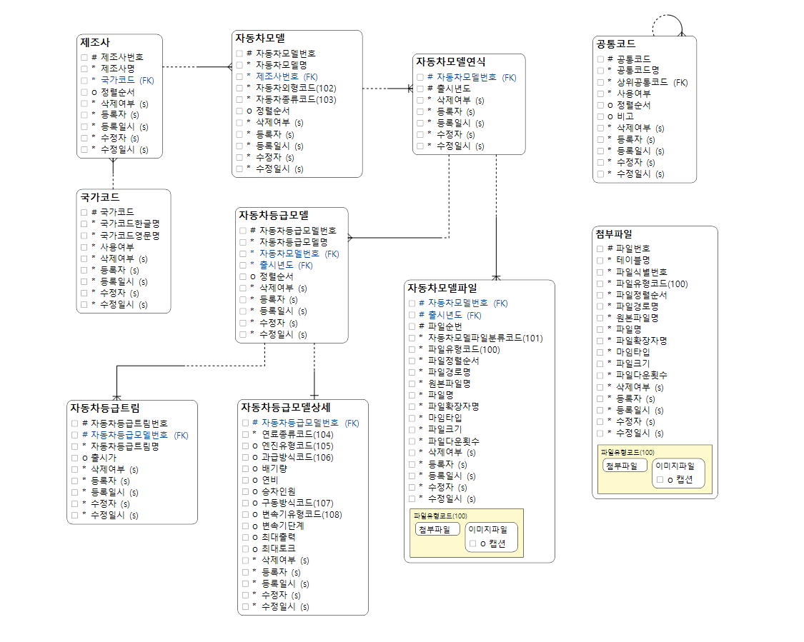
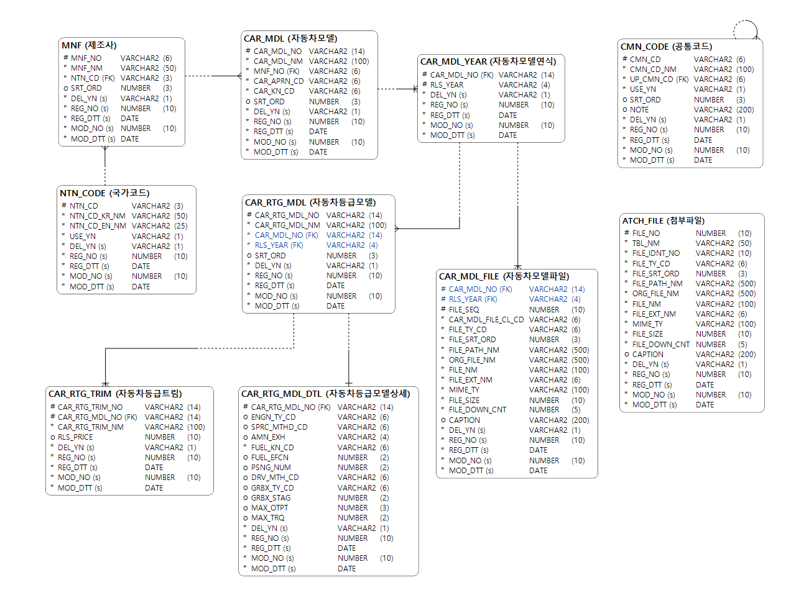
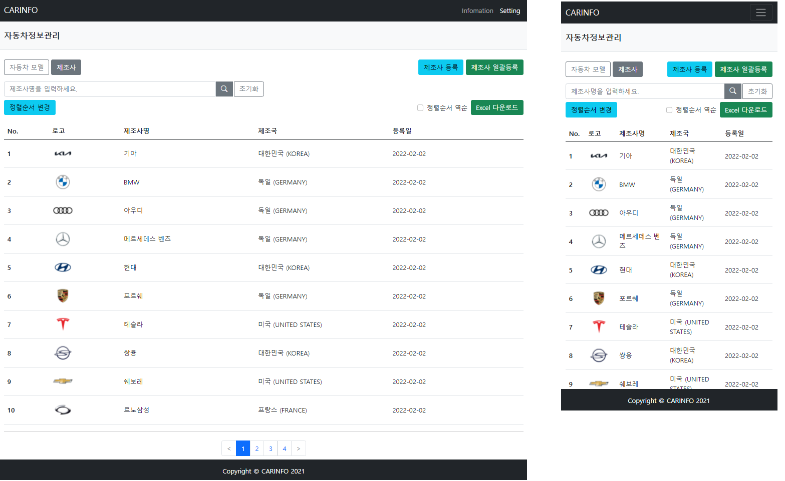
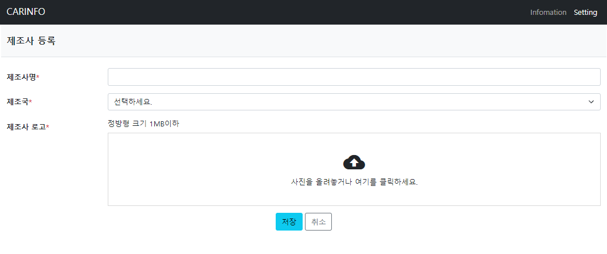
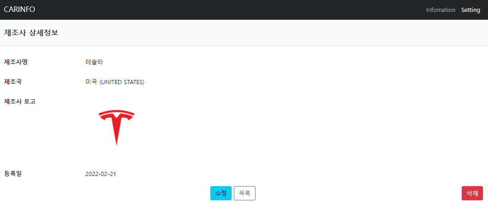
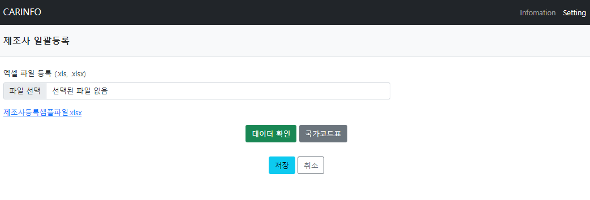
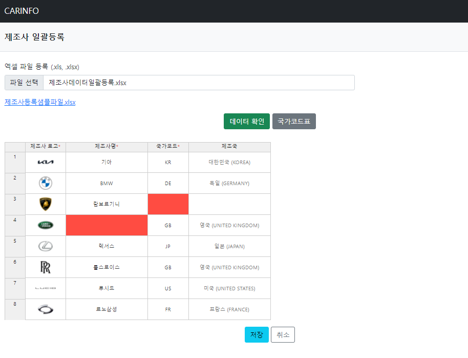
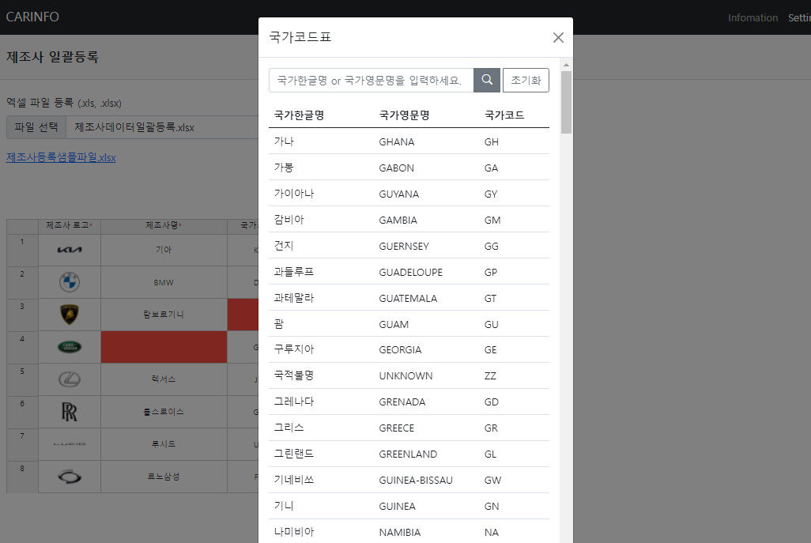
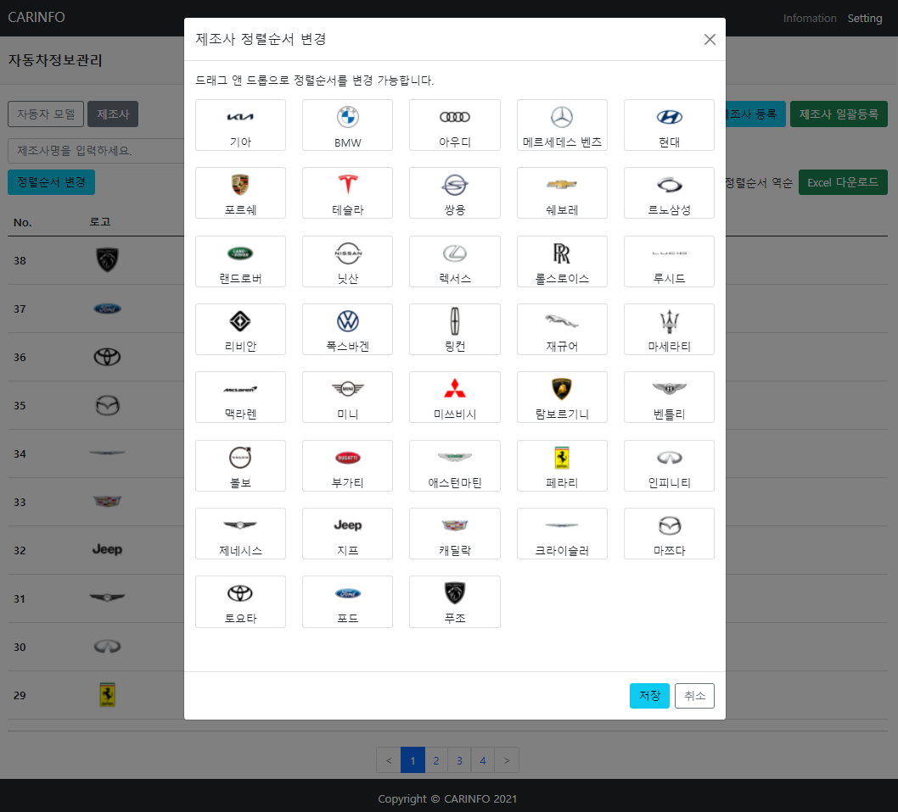
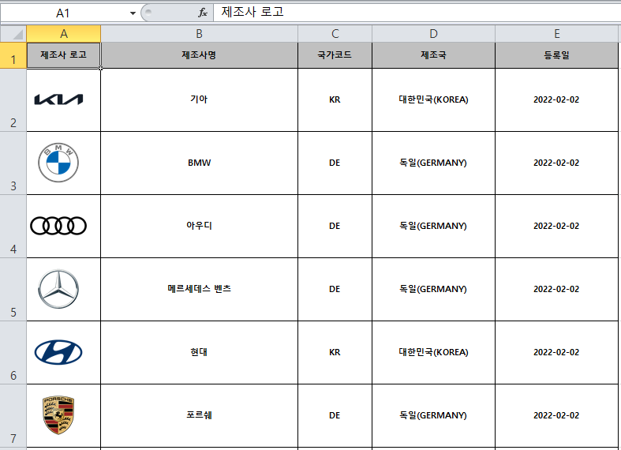

# CARINFO

### 엑셀 업로드, 다운로드 기능 구현을 위한 자동차정보관리 프로젝트입니다.
#### Backend: Spring Boot, Spring MVC, Mybatis, Maven, Java
#### DataBase: ORACLE
#### Frontend: Jsp, ES6, Bootstrap5, JQuery

## 자동차정보관리 기능
- 제조사 목록, 상세정보 보기
- 제조사 등록, 엑셀 일괄등록, 엑셀 일괄등록 전 데이터 검증
- 제조사 엑셀 다운로드
- 제조사 정렬순서 변경
- 자동차 모델 등록 및 관리 (진행중)

## 실행 전
#### properties 파일 설정 필요
- 파일명 : application.properties
- 변수 : spring.datasource, file.updload 정보 설정

## 데이터 모델

## 스크린샷

